## fatih c. akyon

[AI Engineer & Scientist](https://www.linkedin.com/in/fcakyon/). Author of [YOLO26](https://arxiv.org/abs/2606.03748) and [SAHI](https://github.com/obss/sahi), with [20M+ open-source downloads](OPEN_SOURCE.md), [5 patents](https://www.linkedin.com/in/fcakyon/details/patents/), and [1,800+ citations](https://scholar.google.com/citations?user=RHGyDE0AAAAJ&hl=en). Leading enterprise AI model pretraining and design at [Ultralytics](https://www.ultralytics.com/). PhD from the [METU Deep Learning & Computer Vision Lab](https://dlcv.ii.metu.edu.tr/) on efficient distillation for vision-language models, with papers at [CVPR](https://openaccess.thecvf.com/content/CVPR2026W/ABAW/html/Akyon_SenBen_Sensitive_Scene_Graphs_for_Explainable_Content_Moderation_CVPRW_2026_paper.html), [ICASSP](https://ieeexplore.ieee.org/document/10193621), [ICIP](https://ieeexplore.ieee.org/document/9897990), and [Frontiers](https://www.frontiersin.org/journals/medicine/articles/10.3389/fmed.2023.1029198/full).

[LinkedIn](https://www.linkedin.com/in/fcakyon/) · [Twitter](https://twitter.com/fcakyon) · [Google Scholar](https://scholar.google.com/citations?user=RHGyDE0AAAAJ&hl=en) · [Medium](https://fcakyon.medium.com/)

<!-- profile-cards:start -->

## [open source](OPEN_SOURCE.md)

<a href="https://github.com/obss/sahi"><picture><source media="(max-width: 700px) and (prefers-color-scheme: dark)" srcset="assets/cards/open-source-sahi-mobile-dark.png 2.1x"><source media="(max-width: 700px)" srcset="assets/cards/open-source-sahi-mobile-light.png 2.1x"><source media="(max-width: 1100px) and (prefers-color-scheme: dark)" srcset="assets/cards/open-source-sahi-desktop-dark.png 1.65x"><source media="(max-width: 1100px)" srcset="assets/cards/open-source-sahi-desktop-light.png 1.65x"><source media="(prefers-color-scheme: dark)" srcset="assets/cards/open-source-sahi-desktop-dark.png 1.45x"><source media="(min-width: 1101px)" srcset="assets/cards/open-source-sahi-desktop-light.png 1.45x">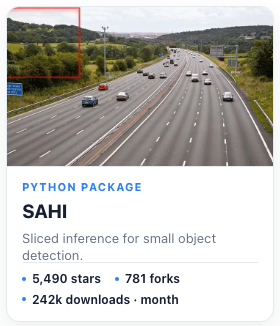</picture></a>
<a href="https://github.com/fcakyon/claude-codex-settings"><picture><source media="(max-width: 700px) and (prefers-color-scheme: dark)" srcset="assets/cards/open-source-claude-codex-settings-mobile-dark.png 2.1x"><source media="(max-width: 700px)" srcset="assets/cards/open-source-claude-codex-settings-mobile-light.png 2.1x"><source media="(max-width: 1100px) and (prefers-color-scheme: dark)" srcset="assets/cards/open-source-claude-codex-settings-desktop-dark.png 1.65x"><source media="(max-width: 1100px)" srcset="assets/cards/open-source-claude-codex-settings-desktop-light.png 1.65x"><source media="(prefers-color-scheme: dark)" srcset="assets/cards/open-source-claude-codex-settings-desktop-dark.png 1.45x"><source media="(min-width: 1101px)" srcset="assets/cards/open-source-claude-codex-settings-desktop-light.png 1.45x">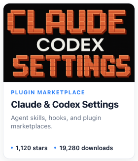</picture></a>
<a href="https://github.com/fcakyon/phd-skills"><picture><source media="(max-width: 700px) and (prefers-color-scheme: dark)" srcset="assets/cards/open-source-phd-skills-mobile-dark.png 2.1x"><source media="(max-width: 700px)" srcset="assets/cards/open-source-phd-skills-mobile-light.png 2.1x"><source media="(max-width: 1100px) and (prefers-color-scheme: dark)" srcset="assets/cards/open-source-phd-skills-desktop-dark.png 1.65x"><source media="(max-width: 1100px)" srcset="assets/cards/open-source-phd-skills-desktop-light.png 1.65x"><source media="(prefers-color-scheme: dark)" srcset="assets/cards/open-source-phd-skills-desktop-dark.png 1.45x"><source media="(min-width: 1101px)" srcset="assets/cards/open-source-phd-skills-desktop-light.png 1.45x"></picture></a>
<a href="https://github.com/ultralytics/ultralytics"><picture><source media="(max-width: 700px) and (prefers-color-scheme: dark)" srcset="assets/cards/open-source-ultralytics-mobile-dark.png 2.1x"><source media="(max-width: 700px)" srcset="assets/cards/open-source-ultralytics-mobile-light.png 2.1x"><source media="(max-width: 1100px) and (prefers-color-scheme: dark)" srcset="assets/cards/open-source-ultralytics-desktop-dark.png 1.65x"><source media="(max-width: 1100px)" srcset="assets/cards/open-source-ultralytics-desktop-light.png 1.65x"><source media="(prefers-color-scheme: dark)" srcset="assets/cards/open-source-ultralytics-desktop-dark.png 1.45x"><source media="(min-width: 1101px)" srcset="assets/cards/open-source-ultralytics-desktop-light.png 1.45x">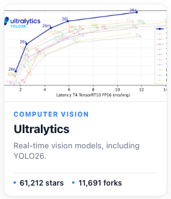</picture></a>

[View all open-source work](OPEN_SOURCE.md)

## [research](PAPERS.md)

<a href="https://arxiv.org/abs/2606.03748"><picture><source media="(max-width: 700px) and (prefers-color-scheme: dark)" srcset="assets/cards/research-yolo26-mobile-dark.png 2.1x"><source media="(max-width: 700px)" srcset="assets/cards/research-yolo26-mobile-light.png 2.1x"><source media="(max-width: 1100px) and (prefers-color-scheme: dark)" srcset="assets/cards/research-yolo26-desktop-dark.png 1.65x"><source media="(max-width: 1100px)" srcset="assets/cards/research-yolo26-desktop-light.png 1.65x"><source media="(prefers-color-scheme: dark)" srcset="assets/cards/research-yolo26-desktop-dark.png 1.45x"><source media="(min-width: 1101px)" srcset="assets/cards/research-yolo26-desktop-light.png 1.45x">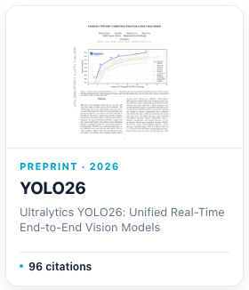</picture></a>
<a href="https://openaccess.thecvf.com/content/CVPR2026W/ABAW/html/Akyon_SenBen_Sensitive_Scene_Graphs_for_Explainable_Content_Moderation_CVPRW_2026_paper.html"><picture><source media="(max-width: 700px) and (prefers-color-scheme: dark)" srcset="assets/cards/research-senben-mobile-dark.png 2.1x"><source media="(max-width: 700px)" srcset="assets/cards/research-senben-mobile-light.png 2.1x"><source media="(max-width: 1100px) and (prefers-color-scheme: dark)" srcset="assets/cards/research-senben-desktop-dark.png 1.65x"><source media="(max-width: 1100px)" srcset="assets/cards/research-senben-desktop-light.png 1.65x"><source media="(prefers-color-scheme: dark)" srcset="assets/cards/research-senben-desktop-dark.png 1.45x"><source media="(min-width: 1101px)" srcset="assets/cards/research-senben-desktop-light.png 1.45x">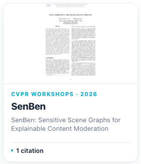</picture></a>
<a href="https://ieeexplore.ieee.org/document/9897990"><picture><source media="(max-width: 700px) and (prefers-color-scheme: dark)" srcset="assets/cards/research-sahi-mobile-dark.png 2.1x"><source media="(max-width: 700px)" srcset="assets/cards/research-sahi-mobile-light.png 2.1x"><source media="(max-width: 1100px) and (prefers-color-scheme: dark)" srcset="assets/cards/research-sahi-desktop-dark.png 1.65x"><source media="(max-width: 1100px)" srcset="assets/cards/research-sahi-desktop-light.png 1.65x"><source media="(prefers-color-scheme: dark)" srcset="assets/cards/research-sahi-desktop-dark.png 1.45x"><source media="(min-width: 1101px)" srcset="assets/cards/research-sahi-desktop-light.png 1.45x">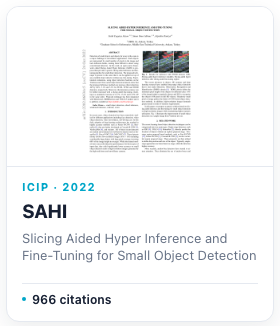</picture></a>
<a href="https://www.frontiersin.org/journals/medicine/articles/10.3389/fmed.2023.1029198/full"><picture><source media="(max-width: 700px) and (prefers-color-scheme: dark)" srcset="assets/cards/research-polypharmacy-ai-mobile-dark.png 2.1x"><source media="(max-width: 700px)" srcset="assets/cards/research-polypharmacy-ai-mobile-light.png 2.1x"><source media="(max-width: 1100px) and (prefers-color-scheme: dark)" srcset="assets/cards/research-polypharmacy-ai-desktop-dark.png 1.65x"><source media="(max-width: 1100px)" srcset="assets/cards/research-polypharmacy-ai-desktop-light.png 1.65x"><source media="(prefers-color-scheme: dark)" srcset="assets/cards/research-polypharmacy-ai-desktop-dark.png 1.45x"><source media="(min-width: 1101px)" srcset="assets/cards/research-polypharmacy-ai-desktop-light.png 1.45x">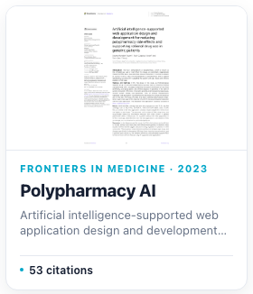</picture></a>

[View all papers](PAPERS.md)

## [public speaking](TALKS.md)

<a href="https://www.linkedin.com/feed/update/urn:li:activity:7495862925241360384/"><picture><source media="(max-width: 700px) and (prefers-color-scheme: dark)" srcset="assets/cards/talks-open-source-ai-competition-mobile-dark.png 2.1x"><source media="(max-width: 700px)" srcset="assets/cards/talks-open-source-ai-competition-mobile-light.png 2.1x"><source media="(max-width: 1100px) and (prefers-color-scheme: dark)" srcset="assets/cards/talks-open-source-ai-competition-desktop-dark.png 1.65x"><source media="(max-width: 1100px)" srcset="assets/cards/talks-open-source-ai-competition-desktop-light.png 1.65x"><source media="(prefers-color-scheme: dark)" srcset="assets/cards/talks-open-source-ai-competition-desktop-dark.png 1.45x"><source media="(min-width: 1101px)" srcset="assets/cards/talks-open-source-ai-competition-desktop-light.png 1.45x">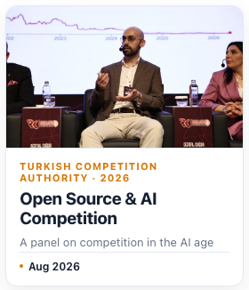</picture></a>
<a href="https://www.linkedin.com/posts/fcakyon_when-the-creator-of-claude-code-boris-cherny-activity-7462203933130772480-DIph"><picture><source media="(max-width: 700px) and (prefers-color-scheme: dark)" srcset="assets/cards/talks-claude-code-ankara-mobile-dark.png 2.1x"><source media="(max-width: 700px)" srcset="assets/cards/talks-claude-code-ankara-mobile-light.png 2.1x"><source media="(max-width: 1100px) and (prefers-color-scheme: dark)" srcset="assets/cards/talks-claude-code-ankara-desktop-dark.png 1.65x"><source media="(max-width: 1100px)" srcset="assets/cards/talks-claude-code-ankara-desktop-light.png 1.65x"><source media="(prefers-color-scheme: dark)" srcset="assets/cards/talks-claude-code-ankara-desktop-dark.png 1.45x"><source media="(min-width: 1101px)" srcset="assets/cards/talks-claude-code-ankara-desktop-light.png 1.45x">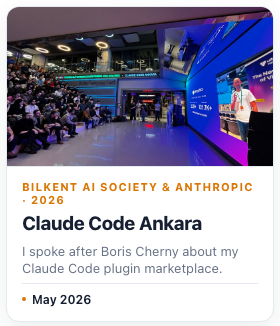</picture></a>
<a href="https://www.linkedin.com/feed/update/urn:li:ugcPost:7401704227871293440/"><picture><source media="(max-width: 700px) and (prefers-color-scheme: dark)" srcset="assets/cards/talks-effective-ai-usage-mobile-dark.png 2.1x"><source media="(max-width: 700px)" srcset="assets/cards/talks-effective-ai-usage-mobile-light.png 2.1x"><source media="(max-width: 1100px) and (prefers-color-scheme: dark)" srcset="assets/cards/talks-effective-ai-usage-desktop-dark.png 1.65x"><source media="(max-width: 1100px)" srcset="assets/cards/talks-effective-ai-usage-desktop-light.png 1.65x"><source media="(prefers-color-scheme: dark)" srcset="assets/cards/talks-effective-ai-usage-desktop-dark.png 1.45x"><source media="(min-width: 1101px)" srcset="assets/cards/talks-effective-ai-usage-desktop-light.png 1.45x">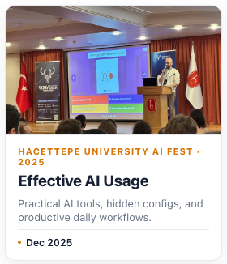</picture></a>
<a href="https://www.linkedin.com/posts/fcakyon_two-weeks-ago-i-gave-a-workshop-on-how-activity-7396079674310692864-kTFV"><picture><source media="(max-width: 700px) and (prefers-color-scheme: dark)" srcset="assets/cards/talks-10x-graduate-research-mobile-dark.png 2.1x"><source media="(max-width: 700px)" srcset="assets/cards/talks-10x-graduate-research-mobile-light.png 2.1x"><source media="(max-width: 1100px) and (prefers-color-scheme: dark)" srcset="assets/cards/talks-10x-graduate-research-desktop-dark.png 1.65x"><source media="(max-width: 1100px)" srcset="assets/cards/talks-10x-graduate-research-desktop-light.png 1.65x"><source media="(prefers-color-scheme: dark)" srcset="assets/cards/talks-10x-graduate-research-desktop-dark.png 1.45x"><source media="(min-width: 1101px)" srcset="assets/cards/talks-10x-graduate-research-desktop-light.png 1.45x"></picture></a>

[View all talks](TALKS.md)

## [products](PRODUCTS.md)

<a href="https://myaipatient.com"><picture><source media="(max-width: 700px) and (prefers-color-scheme: dark)" srcset="assets/cards/products-my-ai-patient-mobile-dark.png 2.1x"><source media="(max-width: 700px)" srcset="assets/cards/products-my-ai-patient-mobile-light.png 2.1x"><source media="(max-width: 1100px) and (prefers-color-scheme: dark)" srcset="assets/cards/products-my-ai-patient-desktop-dark.png 1.65x"><source media="(max-width: 1100px)" srcset="assets/cards/products-my-ai-patient-desktop-light.png 1.65x"><source media="(prefers-color-scheme: dark)" srcset="assets/cards/products-my-ai-patient-desktop-dark.png 1.45x"><source media="(min-width: 1101px)" srcset="assets/cards/products-my-ai-patient-desktop-light.png 1.45x">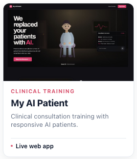</picture></a>
<a href="https://fastrational.com"><picture><source media="(max-width: 700px) and (prefers-color-scheme: dark)" srcset="assets/cards/products-fast-rational-mobile-dark.png 2.1x"><source media="(max-width: 700px)" srcset="assets/cards/products-fast-rational-mobile-light.png 2.1x"><source media="(max-width: 1100px) and (prefers-color-scheme: dark)" srcset="assets/cards/products-fast-rational-desktop-dark.png 1.65x"><source media="(max-width: 1100px)" srcset="assets/cards/products-fast-rational-desktop-light.png 1.65x"><source media="(prefers-color-scheme: dark)" srcset="assets/cards/products-fast-rational-desktop-dark.png 1.45x"><source media="(min-width: 1101px)" srcset="assets/cards/products-fast-rational-desktop-light.png 1.45x">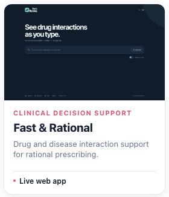</picture></a>
<a href="https://muvisafe.com/en"><picture><source media="(max-width: 700px) and (prefers-color-scheme: dark)" srcset="assets/cards/products-muvisafe-mobile-dark.png 2.1x"><source media="(max-width: 700px)" srcset="assets/cards/products-muvisafe-mobile-light.png 2.1x"><source media="(max-width: 1100px) and (prefers-color-scheme: dark)" srcset="assets/cards/products-muvisafe-desktop-dark.png 1.65x"><source media="(max-width: 1100px)" srcset="assets/cards/products-muvisafe-desktop-light.png 1.65x"><source media="(prefers-color-scheme: dark)" srcset="assets/cards/products-muvisafe-desktop-dark.png 1.45x"><source media="(min-width: 1101px)" srcset="assets/cards/products-muvisafe-desktop-light.png 1.45x">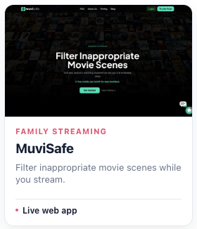</picture></a>

[View all products](PRODUCTS.md)

<!-- profile-cards:end -->
